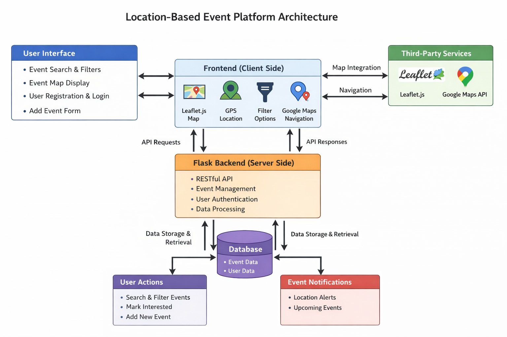
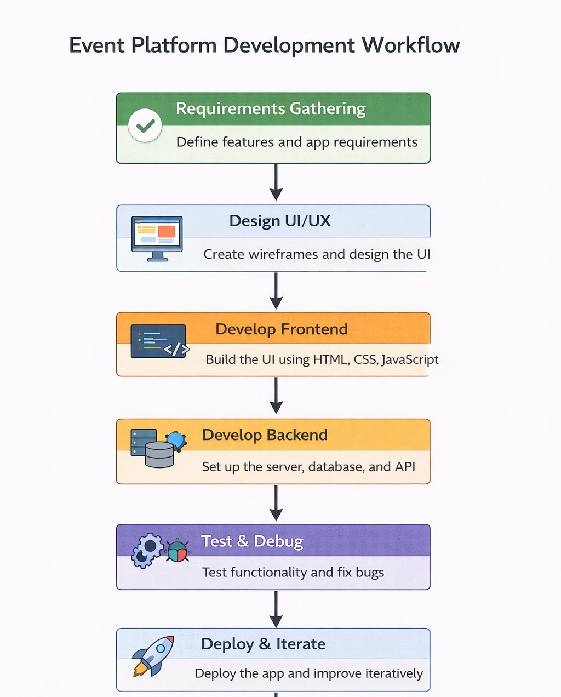

<p align="center">
  
</p>

# [Community Event Finder] 🎯

## Basic Details

### Team Name: [Buggy]

### Team Members
- Member 1: [Vandana Ramesh] - [College Of Engineering Attingal]
- Member 2: [Nandhana Rajesh] - [College Of Engineering Attingal]

### Hosted Project Link
[https://community-event-finder.onrender.com/]

### Project Description
[Our project is a Community Event Finder web application designed to help users discover events happening nearby. The frontend provides filters for categories, places, districts, and time ranges, while the backend (running on Node.js) connects to APIs like Google Maps to fetch and display location‑based results. In short, it’s a location‑aware event discovery tool that combines search, mapping, and user interaction features.]

### The Problem statement
[The problem your project is solving is that people often struggle to discover local events happening around them in real time. Information is scattered across social media, word of mouth, or fragmented platforms, making it difficult to know what’s happening nearby. Your Community Event Finder addresses this by providing a centralized, location‑aware tool where users can search by place, category, and radius to quickly find events in their area.]

### The Solution
[The solution you’re building is a Community Event Finder platform that centralizes event discovery into one accessible tool. You solve the problem by creating a web application with a frontend interface for searching and filtering events (by category, place, district, and time radius) and a backend service connected to APIs like Google Maps to provide location‑based results. By combining these, users can quickly find nearby events without relying on scattered sources, making event discovery simple, interactive, and reliable.]

---

## Technical Details

### Technologies/Components Used

**For Software:**
- Languages used: [Python, HTML, CSS, JavaScript]
- Frameworks used: [Flask ]
- Libraries used: [Leaflet, OpenStreetMap, Nominatim, hashlib, SQLite]
- Tools used: [Browser Geolocation API, Google Maps, Haversine Formula, Google Fonts]

**For Hardware:**
- Main components: [List main components]
- Specifications: [Technical specifications]
- Tools required: [List tools needed]

---

## Features

List the key features of your project:
- Feature 1: [Location based Event Search]
- Feature 2: [Distance filtering using Haversine Formula]
- Feature 3: [Route navigation via Google Maps]
- Feature 4: [Multi level Filtering]
- Feature 5: [Community Event Submission with map pinning]
---

## Implementation

### For Software:

#### Installation
```bash
[python -m venv venv, venv\Scripts\activate, pip install flask, python app.py]
```

#### Run
```bash
[venv\Scripts\activate    , python app.py]
```

### For Hardware:

#### Components Required
[List all components needed with specifications]

#### Circuit Setup
[Explain how to set up the circuit]

---

## Project Documentation

### For Software:

#### Screenshots (Add at least 3)


*The platform enables users to discover nearby events through location-based search, distance filtering, interactive map visualization, real-time GPS detection, and navigation support via Leaflet and Google Maps.*


*The platform allows registered users to add new events by entering event details and selecting the exact location on the map, which is then stored in the database through a Flask backend.*


*When a user clicks **“Interested,”** the system pins the event’s exact location on an interactive map using Leaflet and provides navigation directions via Google Maps.*

![<docs/Screenshot 2026-02-20 214554.png>]
*The system displays all available events and allows users to filter them based on their preferred location and selected distance radius to find nearby events.*

![<docs/Screenshot 2026-02-20 214621.png>]
*The front page provides filtering options that allow users to select district, area, category, and distance to easily find events that match their preferences.*


#### Diagrams

**System Architecture:**


*Our system is a location-based event platform that follows a simple three-layer architecture: frontend, backend, and database. The frontend displays events on an interactive map using Leaflet.js, gets the user’s location through GPS, and allows users to search, filter, register, and add new events. It sends requests to the Flask backend, which handles user authentication, processes event data, and applies filtering logic. The backend communicates with the database to store and retrieve user and event information, and then sends the results back to the frontend in JSON format. Google Maps API is integrated for navigation. This structure ensures smooth communication between components and efficient event management.*

**Application Workflow:**


*This flowchart shows the development process of the Community Event Finder, from planning and design to development, testing, and final deployment.*
---

### For Hardware:

#### Schematic & Circuit


*Add caption explaining connections*


*Add caption explaining the schematic*

#### Build Photos

![docs/WhatsApp Image 2026-02-21 at 9.57.55 AM.jpeg]


*List out all components shown*


*Explain the build steps*


*Explain the final build*

---

## Additional Documentation

### For Web Projects with Backend:

#### API Documentation

**Base URL:** `https://api.yourproject.com`

##### Endpoints

**GET /api/endpoint**
- **Description:** [What it does]
- **Parameters:**
  - `param1` (string): [Description]
  - `param2` (integer): [Description]
- **Response:**
```json
{
  "status": "success",
  "data": {}
}
```

**POST /api/endpoint**
- **Description:** [What it does]
- **Request Body:**
```json
{
  "field1": "value1",
  "field2": "value2"
}
```
- **Response:**
```json
{
  "status": "success",
  "message": "Operation completed"
}
```

[Add more endpoints as needed...]

---

### For Mobile Apps:

#### App Flow Diagram


*Explain the user flow through your application*

#### Installation Guide

**For Android (APK):**
1. Download the APK from [Release Link]
2. Enable "Install from Unknown Sources" in your device settings:
   - Go to Settings > Security
   - Enable "Unknown Sources"
3. Open the downloaded APK file
4. Follow the installation prompts
5. Open the app and enjoy!

**For iOS (IPA) - TestFlight:**
1. Download TestFlight from the App Store
2. Open this TestFlight link: [Your TestFlight Link]
3. Click "Install" or "Accept"
4. Wait for the app to install
5. Open the app from your home screen

**Building from Source:**
```bash
# For Android
flutter build apk
# or
./gradlew assembleDebug

# For iOS
flutter build ios
# or
xcodebuild -workspace App.xcworkspace -scheme App -configuration Debug
```

---

### For Hardware Projects:

#### Bill of Materials (BOM)

| Component | Quantity | Specifications | Price | Link/Source |
|-----------|----------|----------------|-------|-------------|
| Arduino Uno | 1 | ATmega328P, 16MHz | ₹450 | [Link] |
| LED | 5 | Red, 5mm, 20mA | ₹5 each | [Link] |
| Resistor | 5 | 220Ω, 1/4W | ₹1 each | [Link] |
| Breadboard | 1 | 830 points | ₹100 | [Link] |
| Jumper Wires | 20 | Male-to-Male | ₹50 | [Link] |
| [Add more...] | | | | |

**Total Estimated Cost:** ₹[Amount]

#### Assembly Instructions

**Step 1: Prepare Components**
1. Gather all components listed in the BOM
2. Check component specifications
3. Prepare your workspace

*Caption: All components laid out*

**Step 2: Build the Power Supply**
1. Connect the power rails on the breadboard
2. Connect Arduino 5V to breadboard positive rail
3. Connect Arduino GND to breadboard negative rail

*Caption: Power connections completed*

**Step 3: Add Components**
1. Place LEDs on breadboard
2. Connect resistors in series with LEDs
3. Connect LED cathodes to GND
4. Connect LED anodes to Arduino digital pins (2-6)

*Caption: LED circuit assembled*

**Step 4: [Continue for all steps...]**

**Final Assembly:**

*Caption: Completed project ready for testing*

---

### For Scripts/CLI Tools:

#### Command Reference

**Basic Usage:**
```bash
python script.py [options] [arguments]
```

**Available Commands:**
- `command1 [args]` - Description of what command1 does
- `command2 [args]` - Description of what command2 does
- `command3 [args]` - Description of what command3 does

**Options:**
- `-h, --help` - Show help message and exit
- `-v, --verbose` - Enable verbose output
- `-o, --output FILE` - Specify output file path
- `-c, --config FILE` - Specify configuration file
- `--version` - Show version information

**Examples:**

```bash
# Example 1: Basic usage
python script.py input.txt

# Example 2: With verbose output
python script.py -v input.txt

# Example 3: Specify output file
python script.py -o output.txt input.txt

# Example 4: Using configuration
python script.py -c config.json --verbose input.txt
```

#### Demo Output

**Example 1: Basic Processing**

**Input:**
```
This is a sample input file
with multiple lines of text
for demonstration purposes
```

**Command:**
```bash
python script.py sample.txt
```

**Output:**
```
Processing: sample.txt
Lines processed: 3
Characters counted: 86
Status: Success
Output saved to: output.txt
```

**Example 2: Advanced Usage**

**Input:**
```json
{
  "name": "test",
  "value": 123
}
```

**Command:**
```bash
python script.py -v --format json data.json
```

**Output:**
```
[VERBOSE] Loading configuration...
[VERBOSE] Parsing JSON input...
[VERBOSE] Processing data...
{
  "status": "success",
  "processed": true,
  "result": {
    "name": "test",
    "value": 123,
    "timestamp": "2024-02-07T10:30:00"
  }
}
[VERBOSE] Operation completed in 0.23s
```

---

## Project Demo

### Video
[Add your demo video link here - YouTube, Google Drive, etc.]

*Explain what the video demonstrates - key features, user flow, technical highlights*

### Additional Demos
[Add any extra demo materials/links - Live site, APK download, online demo, etc.]

---

## AI Tools Used (Optional - For Transparency Bonus)

If you used AI tools during development, document them here for transparency:

**Tool Used:** [e.g., GitHub Copilot, v0.dev, Cursor, ChatGPT, Claude]

**Purpose:** [What you used it for]
- Example: "Generated boilerplate React components"
- Example: "Debugging assistance for async functions"
- Example: "Code review and optimization suggestions"

**Key Prompts Used:**
- "Create a REST API endpoint for user authentication"
- "Debug this async function that's causing race conditions"
- "Optimize this database query for better performance"

**Percentage of AI-generated code:** [Approximately X%]

**Human Contributions:**
- Architecture design and planning
- Custom business logic implementation
- Integration and testing
- UI/UX design decisions

*Note: Proper documentation of AI usage demonstrates transparency and earns bonus points in evaluation!*

---

## Team Contributions

- [Name 1]: [Specific contributions - e.g., Frontend development, API integration, etc.]
- [Name 2]: [Specific contributions - e.g., Backend development, Database design, etc.]
- [Name 3]: [Specific contributions - e.g., UI/UX design, Testing, Documentation, etc.]

---

## License

This project is licensed under the [LICENSE_NAME] License - see the [LICENSE](LICENSE) file for details.

**Common License Options:**
- MIT License (Permissive, widely used)
- Apache 2.0 (Permissive with patent grant)
- GPL v3 (Copyleft, requires derivative works to be open source)

---

Made with ❤️ at TinkerHub
